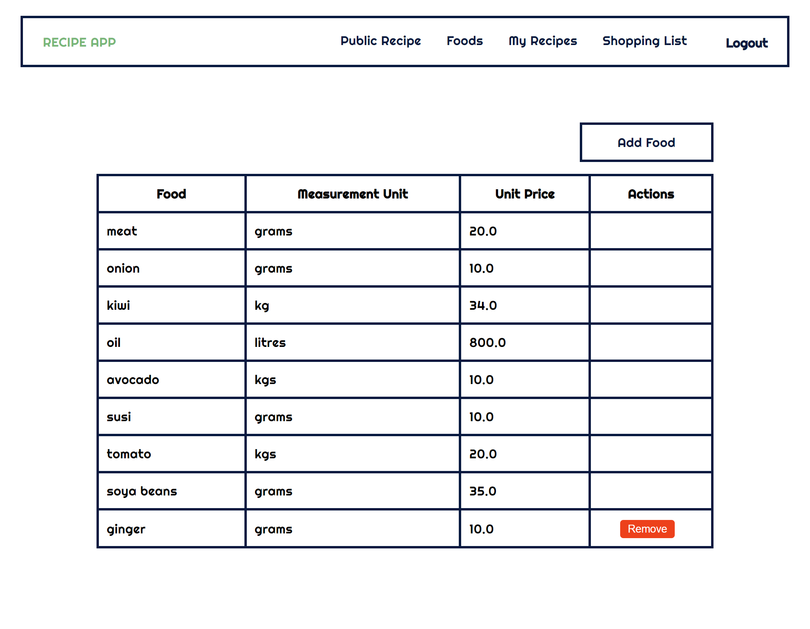

# Recipe app

The Recipe app keeps track of all the recipes, ingredients, and inventory. It will allow you to save ingredients, keep track of what you have, create recipes, and generate a shopping list based on what you have and what you are missing from a recipe. Also, since sharing recipes is an important part of cooking the app should allow to make them public so anyone can access them.

## Getting Started

- Clone the repository
  `git clone https://github.com/maxthestranger/rails_recipe.git`
- Navigate to the folder
  `cd rails_recipe`
- Install packages
  `bundle install`
- Setup database
  `rails db:setup`
- Run migration
  `rails db:migrate`

## Built With

- Ruby
- Ruby on Rails
- PostgreSQL

## Authors

👤 **Selma Belhadj**

- GitHub: [@selma-belhadj](https://github.com/selma-belhadj)
- Twitter: [@Bel_Selma16](https://twitter.com/Bel_Selma16)
- LinkedIn: [@selma-belhadj](https://www.linkedin.com/in/selma-belhadj/)

👤 **Max The Stranger**

- GitHub: [@maxthestranger](https://github.com/maxthestranger)
- Twitter: [@maxthestranger](https://twitter.com/maxthestranger)
- LinkedIn: [@maxthestranger](https://www.linkedin.com/in/maxthestranger/)

## 🤝 Contributing

Contributions, issues, and feature requests are welcome!

Feel free to check the [issues page](https://github.com/maxthestranger/rails_recipe/issues).

## Show your support

Give a ⭐️ if you like this project!

## Acknowledgments

- Hat tip to anyone whose code was used
- Inspiration
- etc

## 📝 License

This project is [MIT](./MIT.md) licensed.
